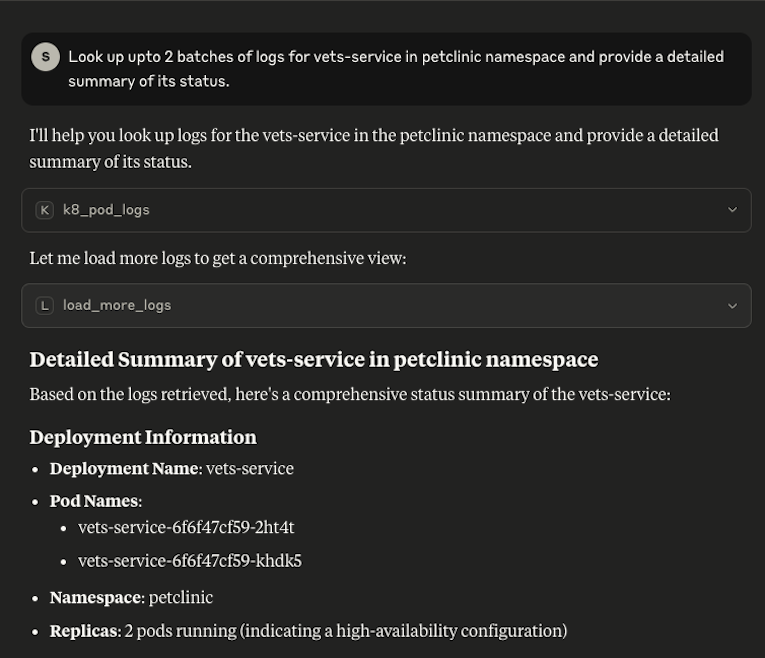
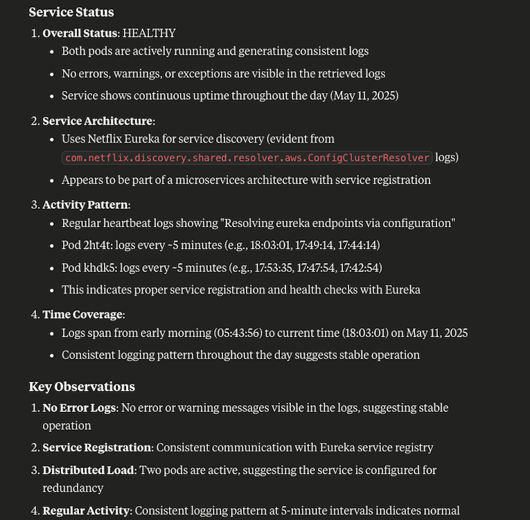

# k8s-log-browser-mcp

An opinionated mcp server that exposes pod logs indexed in opensearch search over MCP. This relies on the assumption that logging is centralized using fluentbit's [kubernetes](https://docs.fluentbit.io/manual/pipeline/filters/kubernetes) filter and [opensearch](https://docs.fluentbit.io/manual/pipeline/outputs/opensearch) with logstash format and per namespace index.

Queries opensearch via SQL plugin endpoint and uses cursors for pagination support.

```
Logstash_Format On
Logstash_Prefix logstash
Logstash_Prefix_Key $kubernetes['namespace_name']
```

> [!WARNING]
> Still Under Active Development, use at your own risk.

Todo:

- Switch to JDBC for better pagination support and parametrization
- Deal with SQL injection
- Use tokens for auth instead of user credentials
- Filter by log level, build number and revision number
- Add support for Kubernetes events

## Usage

### Launch the transport

```
npx -y @smadappa/k8s-log-browser-mcp --host=<OPENSEARCH_URL> --username=<OPENSEARCH_USERNAME> --password=<OPENSEARCH_PASSWORD_BASE64_ENCODED>
```

### Claude Settings

```json
{
  "mcpServers": {
    "k8s-log-browser-mcp": {
      "command": "npx",
      "args": [
        "-y"
        "@smadappa/k8s-log-browser-mcp",
        "--host=<opensearch-url>",
        "--username=<opensearch-username>",
        "--password=<opensearch-password-base64-encoded>"
      ]
    }
  }
}
```

### MCP Inspector

```shell
npx @modelcontextprotocol/inspector npx -y @smadappa/k8s-log-browser-mcp --host=<opensearch-url> --username=<opensearch-username> --password=<opensearch-password-base64-encoded>
```

## Tools

### k8_pod_logs

Readonly tool that searches logs by a pod name prefix in opensearch. Returns the output as text with xml tags as delimiter between blocks

Inputs:

1. namespace: The kubernetes namespace
2. podNamePrefix: The kubernetes pod name. Fetches logs for all pods that start with the name. Include full pod name for logs from 'a' pod or just prefix for all pods of the deployment

Outputs:

Logs in an opinionated format

Example:

```xml
Most recent 50/50 lines retrived from opensearch below:
<query>
select kubernetes,log_processed from petclinic-* where kubernetes.pod_name like 'vets-service%' and not isnull(log_processed.message) order by `log_processed.@timestamp` desc
</query>
<format>
[pod_name] [timestamp] [log_level] [logger_name] [message]
</format>
<results>
vets-service-6f6f47cf59-2ht4t 2025-05-11 18:03:01.491936637 INFO com.netflix.discovery.shared.resolver.aws.ConfigClusterResolver Resolving eureka endpoints via configuration
vets-service-6f6f47cf59-khdk5 2025-05-11 17:53:35.793299878 INFO com.netflix.discovery.shared.resolver.aws.ConfigClusterResolver Resolving eureka endpoints via configuration
..............
</results>
<load-more>There are more logs, request the 'load_more_logs' with the below cursor:
253604f3-0ef5-455e-b835-3d2db071ea3b
If you are done looking up, close the search context using the clear-cursor tool.
</load-more>

```

### load_more_logs

Readonly tool that loads next page of an ongoing search. Uses cursors from opensearch. Request should be issued within 5 minutes of the previous search. We rewrite the cursor to be a uuid, LLMs did not
do well with reproducing the actual cursor from opensearch to the subsequent tool call in limited testing.

Inputs:

1. cursor: The cursor to load more logs for an existing search

Outputs:

Logs in the same format as `k8_pod_logs` tool.

## Demo



